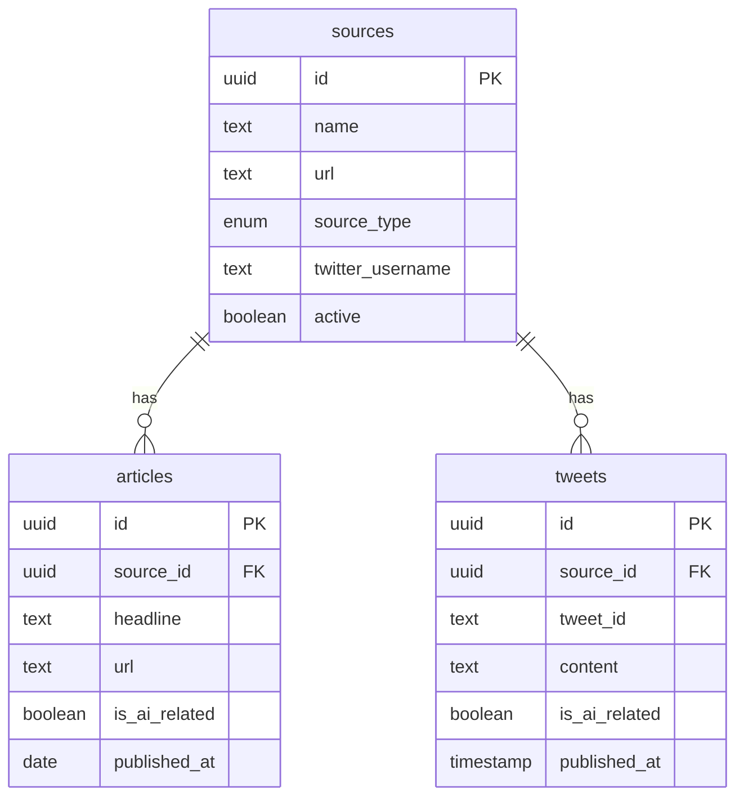

# AI News Aggregator Database Schema Documentation

Generated: 2025-08-22 13:56:55

## Overview

This document describes the actual current state of the database schema for the AI News Aggregator application.

## Data Flow Architecture

The application uses a **dual-table architecture**:
1. **Articles Table**: Stores content from website sources
2. **Tweets Table**: Stores content from Twitter/X sources
3. **Unified Content View**: Provides backward-compatible access to both tables

## Tables and Views

### sources

**Description**: Stores all content sources (websites and Twitter accounts)

**Type**: TABLE

**Row Count**: 15

**Columns**:

| Column Name | Type | Description |
|------------|------|-------------|
| id | uuid | Unique identifier |
| name | text | Source display name |
| url | text | Source URL |
| active | boolean | Whether source is active |
| created_at | timestamp | Creation timestamp |
| category | timestamp | Content category |
| source_type | text | Type: website or twitter |
| twitter_username | unknown (nullable) | Twitter handle (without @) |

### articles

**Description**: Stores articles from website sources

**Type**: TABLE

**Row Count**: 406

**Columns**:

| Column Name | Type | Description |
|------------|------|-------------|
| id | uuid | Unique identifier |
| source_id | text | Reference to sources table |
| headline | text | Article title |
| url | text | Article URL |
| published_at | timestamp | Publication date |
| scraped_at | timestamp | When content was fetched |
| full_content | unknown (nullable) | Full article content |
| is_ai_related | boolean | AI/LLM relevance flag |
| summary | unknown (nullable) | AI-generated summary |
| included_in_newsletter | boolean |  |
| view_count | integer |  |
| tags | array | Content tags |
| image_url | unknown (nullable) |  |
| processing_stage | text | Pipeline stage tracking |
| crawl_batch_id | unknown (nullable) |  |
| actual_published_date | unknown (nullable) |  |
| confidence | unknown (nullable) |  |
| error_message | unknown (nullable) |  |
| retry_count | integer |  |
| tweet_id | unknown (nullable) |  |
| author_username | unknown (nullable) |  |
| like_count | integer |  |
| retweet_count | integer |  |
| reply_count | integer |  |

### tweets

**Description**: Stores tweets from Twitter/X sources

**Type**: TABLE

**Row Count**: 2

**Columns**:

| Column Name | Type | Description |
|------------|------|-------------|
| id | uuid | Unique identifier |
| source_id | text | Reference to sources table |
| tweet_id | text | Twitter tweet ID |
| author_username | text | Tweet author handle |
| content | text | Tweet text content |
| like_count | integer | Number of likes |
| retweet_count | integer | Number of retweets |
| reply_count | integer |  |
| view_count | integer |  |
| bookmark_count | integer |  |
| is_reply | boolean |  |
| is_retweet | boolean |  |
| is_quote_tweet | boolean |  |
| has_media | boolean |  |
| media_urls | unknown (nullable) |  |
| hashtags | unknown (nullable) |  |
| mentions | unknown (nullable) |  |
| urls | unknown (nullable) |  |
| conversation_id | unknown (nullable) |  |
| in_reply_to_tweet_id | unknown (nullable) |  |
| quoted_tweet_id | unknown (nullable) |  |
| thread_position | unknown (nullable) |  |
| quoted_tweet_content | unknown (nullable) |  |
| quoted_tweet_author | unknown (nullable) |  |
| is_ai_related | boolean | AI/LLM relevance flag |
| ai_summary | unknown (nullable) |  |
| ai_tags | array |  |
| ai_relevance_score | unknown (nullable) |  |
| ai_processed_at | unknown (nullable) |  |
| published_at | timestamp | Tweet publication time |
| fetched_at | timestamp |  |
| updated_at | timestamp |  |
| included_in_newsletter | boolean |  |
| newsletter_date | unknown (nullable) |  |
| display_priority | integer |  |

### source_stats

**Description**: Tracks crawling statistics per source

**Type**: TABLE

**Row Count**: 0

### unified_content

**Description**: View combining articles and tweets

**Type**: VIEW

**Row Count**: 406

**Columns**:

| Column Name | Type | Description |
|------------|------|-------------|
| content_type | text |  |
| id | uuid |  |
| source_id | text |  |
| source_name | text |  |
| source_type | text |  |
| headline | text |  |
| url | text |  |
| content | unknown (nullable) |  |
| summary | unknown (nullable) |  |
| is_ai_related | boolean |  |
| tags | array |  |
| published_at | timestamp |  |
| fetched_at | timestamp |  |
| like_count | integer |  |
| retweet_count | integer |  |
| reply_count | integer |  |
| engagement_score | integer |  |
| view_count | integer |  |
| included_in_newsletter | boolean |  |
| image_url | unknown (nullable) |  |
| author_username | unknown (nullable) |  |
| tweet_id | unknown (nullable) |  |

### article_processing_status

**Description**: View for monitoring article processing pipeline

**Type**: VIEW

**Row Count**: 7

**Columns**:

| Column Name | Type | Description |
|------------|------|-------------|
| processing_stage | text |  |
| count | integer |  |
| crawl_date | timestamp |  |

### daily_twitter_stats

**Description**: Materialized view for Twitter statistics

**Type**: VIEW

**Row Count**: 2

**Columns**:

| Column Name | Type | Description |
|------------|------|-------------|
| date | timestamp |  |
| source_name | text |  |
| twitter_username | text |  |
| tweet_count | integer |  |
| ai_tweet_count | integer |  |
| avg_likes | float |  |
| avg_retweets | float |  |
| max_likes | integer |  |
| max_retweets | integer |  |
| total_engagement | integer |  |

## Relationships

## Processing Pipeline

1. **Collection Stage**: Fetch content from sources
2. **AI Filtering Stage**: Identify AI-related content using GPT
3. **Summarization Stage**: Generate summaries for AI content

## API Endpoints

- `/articles/*` - Article-specific endpoints
- `/tweets/*` - Tweet-specific endpoints
- `/content/unified` - Unified content access
- `/sources/*` - Source management
